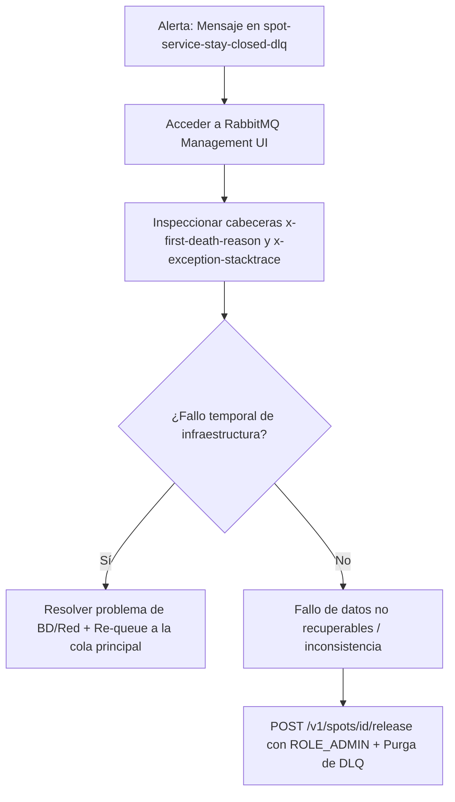

# Protocolo Operacional de Dead Letter Queue (DLQ) — `spot-service`

Este documento establece el procedimiento operativo, responsabilidades e impacto funcional cuando un mensaje acaba en la **Dead Letter Queue (DLQ)** de `spot-service`.

---

## 1. Contexto e Impacto de Negocio

* **Cola Principal:** `spot-service-stay-closed-queue`
* **Dead Letter Exchange (DLX):** `spot-service-stay-closed-dlx`
* **Dead Letter Queue (DLQ):** `spot-service-stay-closed-dlq`
* **Evento procesado:** `StayClosedEvent` (Cierre de estancia de un vehículo).

### 🚨 Impacto de un mensaje en la DLQ:
Un mensaje en la DLQ de `spot-service` representa una estancia que ha finalizado pero la plaza de parking correspondiente **ha permanecido en estado `OCCUPIED`** en el inventario.
- **Riesgo:** Inconsistencia de inventario. El sistema considera que la plaza está ocupada por un coche que ya salió, impidiendo que nuevos vehículos la ocupen.
- **Causa típica:** Fallos persistentes de conexión con la base de datos de plazas o errores no recuperables de infraestructura tras 6 intentos con backoff exponencial.

---

## 2. Roles y Responsabilidades

* **Responsable de la revisión:** Equipo de Operaciones / Soporte L2 / Administrador del Sistema.
* **Mecanismo de Monitoreo:** 
  - Alerta en Grafana / Prometheus o consola de RabbitMQ cuando la métrica `rabbitmq_queue_messages{queue="spot-service-stay-closed-dlq"}` sea `> 0`.

---

## 3. Protocolo de Diagnóstico y Resolución

Cuando un mensaje llega a la DLQ, el operador **NO** puede dejar el mensaje sin procesar. Se debe seguir este flujo:



### Paso 1: Inspección del Mensaje
1. Acceder a la interfaz de RabbitMQ Management UI (`http://localhost:15672` o consola de staging/producción).
2. Seleccionar la cola `spot-service-stay-closed-dlq`.
3. Hacer clic en **"Get Message(s)"** para ver el contenido del mensaje y sus cabeceras.
4. Revisar la cabecera `x-first-death-reason` (motivo de rechazo de RabbitMQ) y `x-exception-stacktrace` / `x-exception-message` (adjuntada por `RepublishMessageRecoverer` en Spring AMQP) para identificar la causa raíz exacta y extraer el `spotId`.

### Paso 2: Acción Correctora

#### Opción A: Fallo de Infraestructura Temporal (ej. BD de plazas fuera de servicio brevemente)
Si la causa fue una caída temporal que ya ha sido resuelta:
1. Usar la funcionalidad de **Move Messages** (o reenviar mediante la UI/script) desde `spot-service-stay-closed-dlq` hacia la cola principal `spot-service-stay-closed-queue`.
2. Verificar en los logs de `spot-service` que la plaza ha cambiado a estado `AVAILABLE`.

#### Opción B: Fallo por Evento no Procesable o Inconsistencia
Si el mensaje no se puede procesar automáticamente:
1. Identificar el `spotId` afectado desde los datos del evento.
2. Invocar el endpoint administrativo de liberación de plazas:
   - **Método:** `POST`
   - **URL:** `/v1/spots/{spotId}/release`
   - **Autenticación:** Requiere un Bearer token JWT válido con el rol `ROLE_ADMIN`.
3. Registrar la incidencia en la bitácora de auditoría de operaciones.
4. Purga/eliminación del mensaje corregido de la DLQ.

---

## 4. Notas de Despliegue y Migración

### ⚠️ Re-declaración de Cola Existente en RabbitMQ (`PRECONDITION_FAILED`)
Dado que la cola `spot-service-stay-closed-queue` se declaró originalmente sin argumentos de DLQ, RabbitMQ no permite modificar los argumentos de una cola existente sobre la marcha y responderá con el error `PRECONDITION_FAILED` al arrancar el servicio si la cola ya existe en el broker.

**Instrucciones de Despliegue (Paso Previo Obligatorio):**
Antes de desplegar esta versión en un entorno donde la cola ya exista (dev, demo, prod):
1. Acceder a RabbitMQ Management UI (`http://localhost:15672`) -> **Queues** -> Seleccionar `spot-service-stay-closed-queue` -> **Delete Queue**.
2. O ejecutar vía CLI:
   ```bash
   rabbitmqctl delete_queue spot-service-stay-closed-queue
   ```
3. Una vez eliminada, desplegar `spot-service`. El servicio re-creará la cola automáticamente incorporando los argumentos `x-dead-letter-exchange` y `x-dead-letter-routing-key`.
